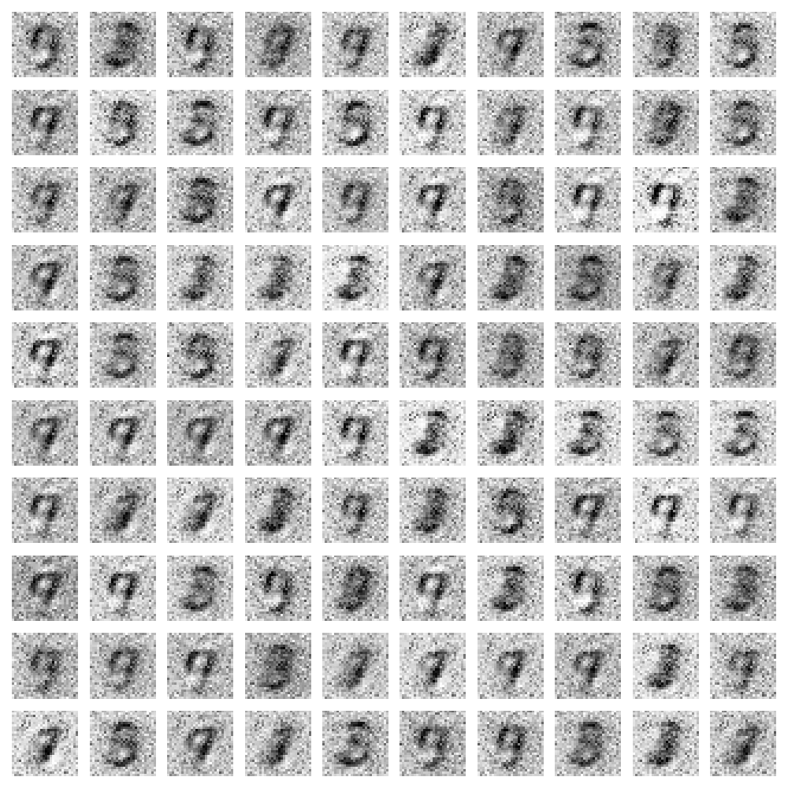
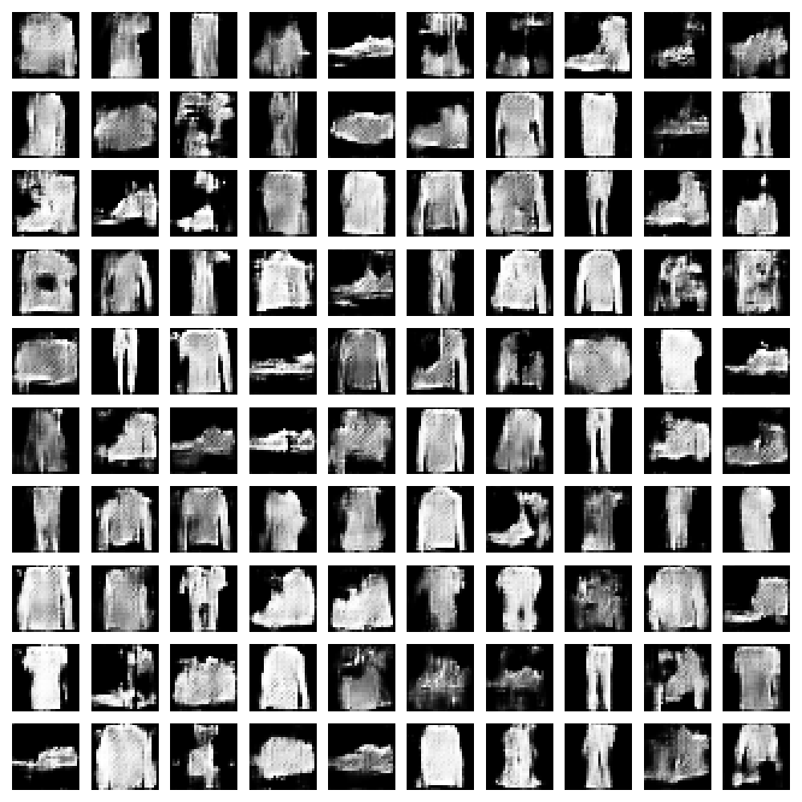

# 🎨 Deep Learning GANs

This repository contains implementations of **Generative Adversarial Networks (GANs)** from scratch using Tensorflow / keras.  
It includes two classic experiments:

- **Vanilla GAN on MNIST** (handwritten digits)
- **DCGAN on Fashion-MNIST** (fashion items)

Both implementations include Jupyter notebooks and equivalent Python scripts, with outputs saved during training.

---

## 🚀 Features
- Vanilla GAN trained on MNIST dataset.
- DCGAN trained on Fashion-MNIST dataset.
- Both notebook (`.ipynb`) and script (`.py`) versions.
- Organized `dcgan_output/` and `vanilla_output/` folders for generated samples and checkpoints.
- `assets/` folder showcasing the best generated results.

---

## 📦 Installation

```bash
# Clone the repository
git clone https://github.com/faisal-ajao/deep-learning-gans.git
cd deep-learning-gans

# (Optional) Create a virtual environment
python -m venv venv
source venv/bin/activate   # Linux/Mac
venv\\Scripts\\activate     # Windows

# Install dependencies
pip install -r requirements.txt
```

---

## ▶️ Usage

Run the notebooks interactively:

```bash
jupyter notebook
```

Or execute the Python scripts directly:

```bash
# Vanilla GAN on MNIST
python vanilla_gan_mnist.py

# DCGAN on Fashion-MNIST
python dcgan_fashion_mnist.py
```

Generated images and model checkpoints will be saved inside the respective output folders.

---

## 📊 Results Preview

**Vanilla GAN (MNIST)** 
<p>
  
</p>

**DCGAN (Fashion-MNIST)** 
<p>
  
</p>

---

## 📂 Project Structure
```
deep-learning-gans/
├── README.md
├── assets/                     # Showcasing the best generated results.
│   ├── dcgan_fashion_mnist.png
│   └── vanilla_gan_mnist.png
├── dcgan_fashion_mnist.py      # DCGAN script
├── dcgan_fashion_mnist.ipynb   # DCGAN notebook
├── vanilla_gan_mnist.py        # Vanilla GAN script
├── vanilla_gan_mnist.ipynb     # Vanilla GAN notebook
├── dcgan_output/               # Empty by default (training results go here)
│   └── .gitkeep
├── vanilla_output/             # Empty by default (training results go here)
│   └── .gitkeep
└── requirements.txt            # Project dependencies
```

---

## 🧠 Tech Stack
- Python 3.10
- Tensorflow / Keras
- NumPy
- Matplotlib

---

## 📜 License
This project is licensed under the MIT License – see the [LICENSE](LICENSE) file for details.
